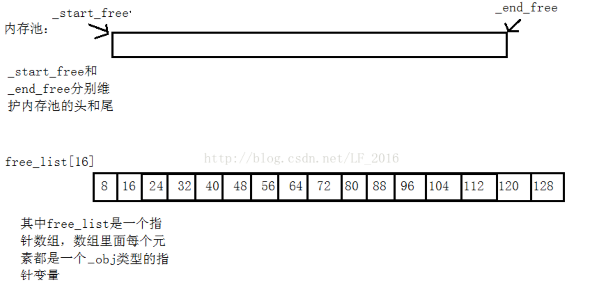

[STL空间配置器解析-CSDN博客](https://blog.csdn.net/LF_2016/article/details/53511648)

[std::allocator - cppreference.com](https://en.cppreference.com/w/cpp/memory/allocator.html)

为什么要有空间配置器呢？这主要是从两个方面来考虑的。
**1、小块内存带来的内存碎片问题**
  单从分配的角度来看。由于频繁分配、释放小块内存容易在堆中造成外碎片(极端情况下就是堆中空闲的内存总量满足一个请求，但是这些空闲的块都不连续，导致任何一个单独的空闲的块都无法满足这个请求)。

**2、小块内存频繁申请释放带来的性能问题。**
  关于性能这个问题要是再深究起来还是比较复杂的，下面我来简单的说明一下。
  开辟空间的时候，分配器会去找一块空闲块给用户，找空闲块也是需要时间的，尤其是在外碎片比较多的情况下。如果分配器其找不到，就要考虑处理假碎片现象(释放的小块空间没有合并)，这时候就要将这些已经释放的的空闲块进行合并，这也是需要时间的。
  **malloc在开辟空间的时候，这些空间会带有一些附加的信息，这样的话也就造成了空间的利用率有所降低，尤其是在频繁申请小块内存的时候。**

 为了解决上面这些问题，所以就提出有了内存池的概念。内存池最基本的思想就是一次向heap申请一块很大的内存(内存池)，如果申请小块内存的话就直接到内存池中去要。这样的话，就能够有效的解决上面所提到的问题。


## 一级
下面我们来剖析一下STL里面的空间配置器(SGI版)。
   STL里面的空间配置主要分为两级，一级空间配置器(`__malloc_alloc_template`)和二级空间配置器(`__default_alloc_template`)。
   在STL中默认如果要分配的内存**大于128个字节的话就是大块内存，调用一级空间配置器直接向系统申请**，
   如果**小于等于128个字节的话则认为是小内存，则就去内存池中申请**。
   一级空间配置器很简单，直接封装了malloc和free处理，增加`_malloc_alloc_oom_handle`处理机制。
   二级空间配置器才是`STL`的精华，二级空间配置器主要由`memoryPool+freelist`构成。


SGI以malloc来配置内存。当malloc()失败后，就调用oom_alloc()，如果客户端没有设置内存不足处理机制，则就直接抛出bad_alloc异常信息，或者直接终止程序。如果客户端设置了内存不足处理机制，则他就会一直调用内存处理机制，企图在某次调用之后获得一块足够的内存。但是如果内存不足处理机制设计不好的话，存在死循环的危险。
注意："内存不足处理机制"是客户端的责任，设置"内存不足处理介质"也是客户端的责任。
```cpp
typedef void(*MALLOCALLOC)();//将void (*)()   重命名成MALLOCALLOC
template<int inst>
class _MallocAllocTemplate
{
private:
       static void* _OomMalloc(size_t);//malloc失败的时候调用的函数
       static MALLOCALLOC _MallocAllocOomHandler;         
       //函数指针，内存不足的时候的处理机制
public:
       static void* _Allocate(size_t n)//分配空间n个字节的空间
       {
              void *result=0;
              result = malloc(n);
              if (0 == result)//若果malloc失败，则就调OOM_malloc
                     _OomMalloc(n);
              return result;
       }
       static void _DeAllocate(void *p)//释放这块空间
       {
              free(p);
       }
       static MALLOCALLOC _SetMallocHandler(MALLOCALLOC f)    
       //这是一个函数，参数是一个函数指针，返回值也是一个函数指针
       {
              MALLOCALLOC old = _MallocAllocOomHandler;
              _MallocAllocOomHandler = f;              
              //将内存分配失败的句柄设置为f(让它指向一个内存失败了，
              //让系统去释放其他地方空间的函数)
              return old;
       }
};
template<int inst>
void(* _MallocAllocTemplate<inst>::_MallocAllocOomHandler)()=0;    //默认不设置内存不足处理机制
template<int inst>
void* _MallocAllocTemplate<inst>::_OomMalloc(size_t n)
{
       MALLOCALLOC _MyMallocHandler;//定义一个函数指针
       void *result;               
       while (1)
       {
              _MyMallocHandler = _MallocAllocOomHandler;
              if (0 == _MyMallocHandler) //没有设置内存不足处理机制
                     throw std::bad_alloc();//则抛出异常
              (*_MyMallocHandler)(); 
              //调用内存不足处理的函数，申请释放其他地方的内存
              if (result = malloc(n))                
              //重新申请内存
	            break;
       }
       return result;                              
       //申请成功时，则返回这块内存的地址
}
typedef _MallocAllocTemplate<0> malloc_alloc;
```

## 二级

二级空间配置器：
**二级空间配置器使用内存池+自由链表的形式避免了小块内存带来的碎片化**，提高了分配的效率，提高了利用率。SGI的做法是先判断要开辟的大小是不是大于128，如果大于128则就认为是一块大块内存，调用一级空间配置器直接分配。否则的话就通过内存池来分配，假设要分配8个字节大小的空间，那么他就会去内存池中分配多个8个字节大小的内存块，将多余的挂在自由链表上，下一次再需要8个字节时就去自由链表上取就可以了，如果回收这8个字节的话，直接将它挂在自由链表上就可以了。
 为了便于管理，**二级空间配置器在分配的时候都是以8的倍数对齐**。也就是说二级配置器会将任何小块内存的需求上调到8的倍数处(例如：要7个字节，会给你分配8个字节。要9个字节，会给你16个字节),尽管这样做有内碎片的问题，但是对于我们管理来说却简单了不少。因为这样的话只要维护16个free_list就可以了，free_list这16个结点分别管理大小为
$$
 8,16,24,32,40,48,56,64,72,80,88,86,96,104,112,120,128
$$
 字节大小的内存块就行了。

自由链表的节点类型：
```cpp
union _Obj
{
       union _Obj* _M_free_list_link;
       char _M_client_data[1];    /* The client sees this.        */
};
```


代码：
```cpp
enum { _ALIGN = 8 };              //按照基准值8的倍数进行内存操作
enum { _MAXBYTES = 128 };        //自由链表中最大的块的大小是128
enum { _NFREELISTS = 16 };       //自由链表的长度，等于_MAXBYTES/_ALIGN
template <bool threads, int inst>  //非模板类型参数
class _DefaultAllocTemplate
{
       union _Obj             //自由链表结点的类型
       {
              _Obj* _freeListLink; //指向自由链表结点的指针
              char _clientData[1]; //this client sees
       };
private:
       static char* _startFree;  //内存池的头指针
       static char* _endFree;    //内存池的尾指针
       static size_t _heapSize;  //记录内存池已经向系统申请了多大的内存
       static _Obj* volatile _freeList[_NFREELISTS];   //自由链表
private:
       static size_t _GetFreeListIndex(size_t bytes)  
       //得到这个字节对应在自由链表中应取的位置
       {
              return (bytes +(size_t) _ALIGN - 1) / (size_t)_ALIGN - 1;     
       }
       static size_t _GetRoundUp(size_t bytes)        
       //对这个字节向上取成8的倍数
       {
              return (bytes + (size_t)_ALIGN - 1)&(~(_ALIGN-1));  
              //将n向上取成8的倍数
       }
       static void* _Refill(size_t n);          
       //在自由链表中申请内存,n表示要的内存的大小
       static char* _chunkAlloc(size_t size,int& nobjs);    
       //在内存池中申请内存nobjs个对象，每个对象size个大小
public:
       static void* Allocate(size_t n);//n要大于0
       static void DeAllocate(void *p,size_t n);
       //n要不等于0
};
```

这段代码的作用是将一个给定的字节数 `bytes` 向上取整到 `_ALIGN` 的倍数。在这个例子中，`_ALIGN` 的值是 8，因此代码的目的是将 `bytes` 向上取整到 8 的倍数。

让我们逐步分析这段代码：

```cpp
static size_t _GetRoundUp(size_t bytes)
{
    return (bytes + (size_t)_ALIGN - 1) & (~(size_t)(_ALIGN - 1));
}
```

> [!NOTE] AI
> #### 1. **`bytes + (size_t)_ALIGN - 1`**
> - **这一步的目的是确保 `bytes` 至少增加到 `_ALIGN` 的下一个倍数**。
> - `_ALIGN` 是一个常量，表示对齐的字节数。在这个例子中，`_ALIGN` 的值是 8。
> - `bytes + (size_t)_ALIGN - 1` 的作用是将 `bytes` 增加到至少 `_ALIGN` 的下一个倍数减 1 的位置。
> 
> #### 2. **`~(_ALIGN - 1)`**
> - `_ALIGN - 1` 的值是 7（如果 `_ALIGN` 是 8）。
> - `~(_ALIGN - 1)` 是对 `_ALIGN - 1` 进行按位取反操作。
> - 如果 `_ALIGN` 是 8，那么 `_ALIGN - 1` 是 7，其二进制表示为 `00000111`。
> - 按位取反后，`~(_ALIGN - 1)` 的值为 `11111000`。
> 
> #### 3. **`(bytes + (size_t)_ALIGN - 1) & (~(size_t)(_ALIGN - 1))`**
> - 这一步是将 `bytes + (size_t)_ALIGN - 1` 的结果与 `~(_ALIGN - 1)` 进行按位与操作。
> - **按位与操作的作用是将结果的低 3 位（如果 `_ALIGN` 是 8）清零**，从而确保结果是 8 的倍数。
> 
>
> #### 代码的通用性
> 这段代码不仅适用于 `_ALIGN` 为 8 的情况，还适用于其他 2 的幂次（如 4、16、32 等）。只要 `_ALIGN` 是 2 的幂次，这段代码都可以正确地将 `bytes` 向上取整到 `_ALIGN` 的倍数。
> 
> #### 总结
> 这段代码的作用是将一个给定的字节数 `bytes` 向上取整到 `_ALIGN` 的倍数。它的实现原理是：
> 6. 将 `bytes` 增加到至少 `_ALIGN` 的下一个倍数减 1 的位置。
> 7. 使用按位取反和按位与操作，将结果的低几位清零，从而确保结果是 `_ALIGN` 的倍数。
> 
> 这种方法的优点是效率高，且适用于任意 2 的幂次对齐。
> 
> 


二级空间配置器的逻辑步骤：
假如现在申请n个字节：
1、判断n是否大于128，如果大于128则直接调用一级空间配置器。如果不大于，则将n上调至8的倍数处，然后再去自由链表中相应的结点下面找，如果该结点下面挂有未使用的内存，则摘下来直接返回这块空间的地址。否则的话我们就要调用`refill(size_t n)`函数去内存池中申请。

2、向内存池申请的时候可以多申请几个，`STL`默认一次申请`nobjs=20`个，将多余的挂在自由链表上，这样能够提高效率。
进入`refill`函数后，先调`chunk_alloc(size_t n,size_t& nobjs)`函数去内存池中申请，如果申请成功的话，再回到`refill`函数。
这时候就有两种情况，如果`nobjs=1`的话则表示内存池只够分配一个，这时候只需要返回这个地址就可以了。否则就表示`nobjs`大于1，则将多余的内存块挂到自由链表上。
如果`chunk_alloc`失败的话，在他内部有处理机制。

3、进入`chunk_alloc(size_t n,size_t& nobjs )`向内存池申请空间的话有三种情况：
  3.1、内存池剩余的空间足够`nobjs*n`这么大的空间，则直接分配好返回就可以了。
  3.2、内存池剩余的空间`leftAlloc`的范围是`n<=leftAlloc<nobjs*n`,则这时候就分配`nobjs=(leftAlloc)/n`这么多个的空间返回。
  3.3、内存池中剩余的空间连一个n都不够了，这时候就要向`heap`申请内存，不过在申请之前先要将内存池中剩余的内存挂到自由链表上，之后再向`heap`申请。
	   3.3.1、如果申请成功的话，则就再调一次`chunk_alloc`重新分配。
	   3.3.2、如果不成功的话，这时候再去自由链表中看看有没有比n大的空间，如果有就将这块空间还给内存池，然后再调一次`chunk_alloc`重新分配。
	   3.3.3、如果没有的话，则就调用一级空间配置器分配，看看内存不足处理机制能否处理。


完整代码：
```cpp
enum { _ALIGN = 8 };              //按照基准值8的倍数进行内存操作
enum { _MAXBYTES = 128 };        //自由链表中最大的块的大小是128
enum { _NFREELISTS = 16 };       //自由链表的长度，等于_MAXBYTES/_ALIGN
template <bool threads, int inst>  //非模板类型参数
class _DefaultAllocTemplate
{
       union _Obj                      //自由链表结点的类型
       {
              _Obj* _freeListLink;         //指向自由链表结点的指针
              char _clientData[1];          //this client sees
       };
private:
       static char* _startFree;             //内存池的头指针
       static char* _endFree;               //内存池的尾指针
       static size_t _heapSize;              //记录内存池已经向系统申请了多大的内存
       static _Obj* volatile _freeList[_NFREELISTS];    //自由链表
private:
       static size_t _GetFreeListIndex(size_t bytes)   //得到这个字节对应在自由链表中应取的位置
       {
              return (bytes +(size_t) _ALIGN - 1) / (size_t)_ALIGN - 1;     
       }
       static size_t _GetRoundUp(size_t bytes)        //对这个字节向上取成8的倍数
       {
              return (bytes + (size_t)_ALIGN - 1)&(~(_ALIGN-1));     //将n向上取成8的倍数
       }
       static void* _Refill(size_t n);          //在自由链表中申请内存,n表示要的内存的大小
       static char* _chunkAlloc(size_t size,int& nobjs);    //在内存池中申请内存nobjs个对象，每个对象size个大小
public:
       static void* Allocate(size_t n);      //n要大于0
       static void DeAllocate(void *p,size_t n);        //n要不等于0
};
template<bool threads,int inst>
char* _DefaultAllocTemplate<threads,inst>::_startFree = 0;        //内存池的头指针
template<bool threads, int inst>
char* _DefaultAllocTemplate<threads, inst>::_endFree=0;           //内存池的尾指针
template<bool threads, int inst>
size_t _DefaultAllocTemplate<threads, inst>::_heapSize = 0;              //记录内存池已经向系统申请了多大的内存
template<bool threads, int inst>
typename _DefaultAllocTemplate<threads, inst>::_Obj* volatile      //前面加typename表示后面是个类型
_DefaultAllocTemplate<threads, inst>::_freeList[_NFREELISTS] = {0};    //自由链表
 
template<bool threads, int inst>
void* _DefaultAllocTemplate<threads, inst>::Allocate(size_t n)    //分配空间
{
       void *ret;
       //先判断要分配的空间大小是不是大于128个字节
       if (n>_MAXBYTES)      //大于_MAXBYTES个字节则认为是大块内存，直接调用一级空间配置器
       {
              ret = malloc_alloc::_Allocate(n);
       }
       else       //否则就去自由链表中找
       {
              _Obj* volatile *myFreeList = _freeList+_GetFreeListIndex(n);  //让myFreeList指向自由链表中n向上取8的整数倍
              _Obj* result = *myFreeList;
              if (result == 0)  //这个结点下面没有挂内存，则就要去内存池中申请
              {
                     ret = _Refill(_GetRoundUp(n));      //到内存池中申请
              }
              else            //已经在自由链表上找到了内存
              {
                     *myFreeList= result->_freeListLink;      //把第二块空间的地址放到自由链表上
                     ret = result;
              }
       }
       return ret;
}
template<bool threads, int inst>
void _DefaultAllocTemplate<threads, inst>::DeAllocate(void *p, size_t n)   //回收空间
{
       //先判断这个字节的大小
       if (n > _MAXBYTES)  //如果n大于自由链表中结点所能挂的最大内存块，则就直接调用一级指针的释放函数
       {
              malloc_alloc::_DeAllocate(p);
       }
       else        //将这块内存回收到自由链表中
       {
              _Obj* q = (_Obj*)p;
              _Obj* volatile *myFreeList = _freeList + _GetFreeListIndex(n);
              q->_freeListLink = *myFreeList;
              *myFreeList = q;
       }
}
 
template<bool threads,int inst>
void* _DefaultAllocTemplate<threads, inst>::_Refill(size_t n)     //n表示要申请的字节个数
{
       int nobjs = 20;           //向内存池申请的时候一次性申请20个
       char* chunk = _chunkAlloc(n,nobjs);    //因为现在链表中没有，所以要想内存池中申请，多余的再挂到自由链表下面
       if (1 == nobjs)          //只分配到了一个对象
       {
              return chunk;
       }
       _Obj* ret = (_Obj*)chunk;                  //将申请的第一个对象作为返回值
       _Obj* volatile *myFreeList = _freeList+ _GetFreeListIndex(n);
       *myFreeList =(_Obj*)(chunk+n);             //将第二个对象的地址放到自由链表中
       _Obj* cur= *myFreeList;
       _Obj* next=0;
       cur->_freeListLink = 0;
       for (int i = 2; i < nobjs; ++i)             //将剩下的块挂到自由链表上
       {
              next= (_Obj*)(chunk + n*i);
              cur->_freeListLink = next;
              cur = next;
       }
       cur->_freeListLink = 0;
       return ret;
}
template<bool threads, int inst>
char* _DefaultAllocTemplate<threads, inst>::_chunkAlloc(size_t size, int& nobjs)  //向系统中申请内存
{
       char* result = 0;
       size_t totalBytes = size*nobjs;        //总共请求的内存大小
       size_t leftBytes = _endFree - _startFree;      //内存池剩余的大小
       if (leftBytes>=totalBytes)     //如果剩余的大小大于等于申请的大小，则返回这个这内存
       {
              result = _startFree;
              _startFree += totalBytes;
              return result;
       }
       else if (leftBytes>size)         //如果剩余的内存足够分配一个size,
       {
              nobjs=(int)(leftBytes/size);
              result = _startFree;
              _startFree +=(nobjs*size);
              return result;
       }
       else            //内存池中的内存已经不够一个size了
       {
              size_t NewBytes = 2 * totalBytes+_GetRoundUp(_heapSize>>4);       //内存池要开辟的新的容量
              if (leftBytes >0)  //剩余的内存挂到自由链表上
              {
                     _Obj* volatile *myFreeList = _freeList + _GetFreeListIndex(leftBytes);
                     ((_Obj*)_startFree)->_freeListLink = *myFreeList;
                     *myFreeList = (_Obj*)_startFree;
              }
              
              //开辟新的内存
              _startFree = (char*)malloc(NewBytes);
              if (0 == _startFree)                   //如果开辟失败
              {
                     //如果开辟失败的话，则表明系统已经没有内存了，这时候我们就要到自由链表中找一块比n还大的内存块，如果还没有的话，那就掉一级空间配置器
                     for (size_t i = size; i <(size_t)_MAXBYTES;i+=(size_t)_ALIGN)
                     {
                           _Obj* volatile *myFreeList = _freeList + _GetFreeListIndex(i);
                           _Obj* p =*myFreeList;
                           if (NULL != p)       //在自由链表找到一块内存块
                           {
                                  _startFree =(char*)p;                  
                                  //将这个内存块摘下来给内存池
                                  *myFreeList = p->_freeListLink;
                                  _endFree = _startFree + i;
                                  return _chunkAlloc(size, nobjs);  //内存池开辟好的话，就再调一次chunk分配内存
                           }
                     }
                     //要是再找不到的话，就调一级空间配置器，其中有内存不足处理机制,要是还不行的话，他会自动抛出异常
                     _endFree = NULL;
                     _startFree=(char*)malloc_alloc::_Allocate(NewBytes);
              }      
              //开辟成功的，就更新heapSize(记录总共向系统申请了多少内存),，更新_endFree
              _heapSize += NewBytes;
              _endFree = _startFree + NewBytes;
              return _chunkAlloc(size, nobjs);             //内存池开辟好的话，就再调一次chunk分配内存
       }
}
 
typedef _DefaultAllocTemplate<0,0>  default_alloc;
```


空间配置器的其他问题：
1、**在空间配置器中所有的函数和变量都是静态的，所以他们在程序结束的时候才会被释放发**。二级空间配置器中没有将申请的内存还给操作系统，只是将他们挂在自由链表上。所以说只有当你的程序结束了之后才会将开辟的内存还给操作系统。

2、由于它没有将内存还给操作系统，所以就会出现二种极端的情况。
 2.1、假如不断的开辟小块内存，最后将整个heap上的内存都挂在了自由链表上，但是都没有用这些空间，再想要开辟一个**大块内存的话会开辟失败**。
 2.2、再比如不断的开辟char,最后将整个heap内存全挂在了自由链表的第一个结点的后面，这时候我再想开辟一个16个字节的内存，也会失败。

3、二级空间配置器会造成内碎片问题，**极端的情况下一直申请char**，则就会浪费7/8的空间。但是整体来说，空间配置器的性能还是蛮高的。


