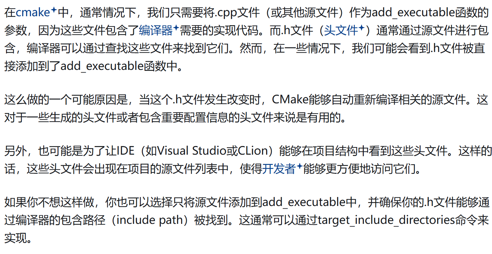

# tcc

在C++中，许多用户更喜欢将模板源代码和内联函数保存在单独的文件中。严格地说，它是一个头文件，但它倾向于获得另一组约定(`.inl`、`.tcc`以及可能还有很多其他约定)。

解答：
[什么是 .tcc？ - Post.Byes --- What is .tcc? - Post.Byes](https://post.bytes.com/forum/topic/c/109163-what-is-tcc)
[.cc和.cpp文件后缀有什么区别？-腾讯云开发者社区-腾讯云](https://cloud.tencent.com/developer/ask/sof/59122)

在 C++ 项目中，`.tcc` 文件并不是 C++ 标准规定的后缀，而是一种**社区约定俗成**的命名方式，主要用于**存放模板（template）的实现代码**。

---

### 📌 `.tcc` 文件的含义与作用

- **含义**：  
  `.tcc` 通常被解释为 **"template C++ code"**，即**模板实现文件**。

- **作用**：  
  用于**将模板类或模板函数的实现从 `.h` 头文件中分离出来**，避免头文件过于臃肿，同时保留模板必须在头文件中可见的特性（因为模板是编译期展开的）。

- **使用方式**：  
  一般在 `.hpp` 或 `.h` 文件末尾通过 `#include "xxx.tcc"` 引入，确保模板定义在使用它的每个翻译单元中都可见。

---

### ✅ 示例结构

```cpp
// MyVector.hpp
#ifndef MYVECTOR_HPP
#define MYVECTOR_HPP

template<typename T>
class MyVector {
public:
    void push_back(const T& value);
};

#include "MyVector.tcc"  // 关键点：在头文件中引入 .tcc
#endif
```

```cpp
// MyVector.tcc
#ifndef MYVECTOR_TCC
#define MYVECTOR_TCC

#include "MyVector.hpp"  // 防止独立编译

template<typename T>
void MyVector<T>::push_back(const T& value) {
    // 实现代码
}

#endif
```

---

### ⚖️ `.tcc` vs `.cpp` vs `.h` 的区别

| 文件类型 | 用途 | 是否可独立编译 | 是否含实现 | 备注 |
|----------|------|------------------|-------------|------|
| `.h` / `.hpp` | 声明类、函数、模板等 | ❌ | 可含内联实现 | 通常不包含非内联实现 |
| `.cpp` / `.cc` | 实现普通函数、类成员等 | ✅ | ✅ | 模板实现**不能**放这里（会导致链接错误） |
| `.tcc` / `.icc` / `.inl` | 模板实现、内联函数实现 | ❌ | ✅ | 被 `#include` 到头文件中，**不是独立源文件** |

---

### ✅ 总结一句话：

> `.tcc` 是**存放模板实现代码的约定文件**，用于**将模板定义从头文件中分离出来**，它不是标准必须的，但在大型项目中能提高可读性和维护性。


# inl

### 📌 含义

- **inl = inline** 的缩写，因此常被读作 “inline-file”。
    
- 用来存放 **内联函数、模板函数 / 类、或者较大的宏定义** 的实现代码。
    

### 📌 典型场景

1. 把模板实现从头文件里“**搬出去**”，避免 `.hpp` 太长。
    
2. 把类里大量 `inline` 成员函数的实现**折叠**到 `.inl`，让头文件更易读。
    
3. 微软 ATL / WTL、Boost 等库大量使用 `.inl`，因此很多 Windows 开发者更熟悉它。


# include语句通常放在头文件末尾

一句话：**必须在使用者（即具体实例化点）之前让模板实现可见，否则编译器在实例化时找不到定义就会报 “undefined reference” 或 “未解析的外部符号”。**

---

### 🔍 为什么“放在头文件末尾”就能保证这一点？

1. 模板不是普通函数  
   普通函数可以“先声明、后定义”，因为链接阶段再去找实现即可。  
   模板只有在**编译期**被实例化时才会生成代码，编译器必须**当场**看到完整定义。

2. 头文件的展开顺序  
   假设用户这样写：

   ```cpp
   // main.cpp
   #include "Foo.hpp"   // ① 展开 Foo.hpp
   int main() {
       Foo<int> f;      // ② 此处需要实例化 Foo<int>::bar()
       f.bar();
   }
   ```

   如果 `Foo.inl` 在 `Foo.hpp` 的**末尾**被 `#include`，那么展开顺序就是：

   ```
   ① Foo.hpp 的类模板声明
   ② Foo.inl 的模板定义
   ```

   于是当编译器走到 `f.bar();` 时，`Foo<int>::bar()` 的完整定义已经可见，可以立即生成目标代码。

3. 如果放在前面会怎样？  
   把 `#include "Foo.inl"` 放在类定义**之前**：

   ```cpp
   #include "Foo.inl"   // ❌ 错误示范
   template<class T>
   class Foo { ... };
   ```

   此时 `Foo.inl` 里的代码试图写：

   ```cpp
   template<class T>
   void Foo<T>::bar() { ... }
   ```

   但编译器还没看到 `Foo` 的声明，`Foo<T>` 是未知类型，直接报错。

---

### ✅ 小结

| 位置 | 结果 |
|------|------|
| 放在类定义之前 | 用到了尚未声明的模板类 → 编译错误 |
| 放在类定义之后、头文件末尾 | 先声明后定义，用户代码 `#include` 时可见 → 正确实例化 |

因此，**“把 `.inl` / `.tcc` 放在头文件末尾”是一种最简单、最可靠的做法**，保证**所有模板定义都在所有使用点之前可见**。


# cmake构建的时候，应该怎么构建含有tcc文件的项目

在 CMake 里 `.tcc` 只是普通的 **头文件后缀**，**不参与编译**（不会被 `add_library / add_executable` 直接列为源文件），因此构建方式与平常相同，但要保证下面两件事：

1. 让编译器能找到它（`include_directories` 或 `target_include_directories`）。  
2. 让 IDE / 代码分析器知道它是项目的一部分（可选，但推荐）。

下面给出最常用、最简洁的 CMakeLists.txt 模板，假设目录结构如下：

```
project-root
├── CMakeLists.txt
├── include
│   └── MyVector.hpp          # 末尾 `#include "MyVector.tcc"`
│   └── MyVector.tcc
└── src
    └── main.cpp
```

---

### ✅ CMakeLists.txt（最小可运行示例）

```cmake
cmake_minimum_required(VERSION 3.15)
project(demo)

# 1. 告诉编译器去哪里找 .tcc（和 .hpp）
target_include_directories(${PROJECT_NAME}
    PUBLIC
        ${CMAKE_CURRENT_SOURCE_DIR}/include
)

# 2. 真正参与编译的只有 .cpp
add_executable(${PROJECT_NAME}
    src/main.cpp
)

# 3. （可选）让 IDE 也显示 .tcc / .hpp
target_sources(${PROJECT_NAME} PRIVATE
    include/MyVector.hpp
    include/MyVector.tcc
)
```

- 第 3 步不会多编译任何文件，只是把 `.tcc` 注册进目标，  
  QtCreator / CLion / VSCode + CMake Tools 就能在文件列表里看到它。

---

### 🚫 常见误区

| 错误做法 | 原因 |
|----------|------|
| 把 `.tcc` 写进 `add_executable` / `add_library` 的源文件列表 | 会报 **“No such file or directory”** 或 **“unknown file type”** |
| 用 `set_source_files_properties(xxx.tcc PROPERTIES LANGUAGE CXX)` 强制编译 | 没必要；`.tcc` 不是翻译单元 |

---

### ✅ 一句话总结

> 对 CMake 来说，`.tcc` 就是“被 `#include` 的头文件”，**别把它当成源文件**。  
> 只要保证 **能被找到** 和（可选）**能被 IDE 看到** 即可。


# 

先把结论写在前面：

> `add_executable` 里**真正参与编译的永远只是源文件**（`.cpp`/`.cc`/`.cxx`…）。  
> 把**头文件**（`.h`/`.hpp`/`.tcc`/`.inl`/…）写进 `add_executable` **不会多编译任何东西**，它只是告诉  
> “把这个文件也当作目标的源文件（source file）登记一下”，  
> 这样 IDE / Ninja / Makefile 在生成项目索引、依赖图、或打包安装时能看见它。  
> 因此写与不写对**可执行文件本身没有任何影响**；写了不会错，不写也不会漏编译。

---

### 1. 为什么 `main.cpp defineTest.h` 也能过？

- 对 CMake 来说，`defineTest.h` 不是“源文件”，但它依旧被原封不动地传给底层生成器（Ninja、Make、VS…）。  
- 底层生成器一看文件后缀不是 `.cpp`，就直接忽略编译步骤，只做依赖扫描。  
- 结果：编译阶段 `defineTest.h` 被跳过，**不会尝试去“编译”它**，所以不会报错。

### 2. `.tcc` 写进去会怎样？

- 与 `.h`、`.hpp`、`.inl` 完全一样：  
  CMake 把它登记为目标的一个“源”，但编译器不会把它当成翻译单元。  
- 因此写成  
  ```cmake
  add_executable(demo main.cpp defineTest.tcc)
  ```  
  同样**不会触发编译**，只是让 IDE 把 `defineTest.tcc` 列进文件树。

### 3. 什么时候会报错？

- 只有在你**强行**告诉 CMake “这是个 C++ 源文件”才会出问题：  
  ```cmake
  set_source_files_properties(defineTest.tcc PROPERTIES LANGUAGE CXX)
  ```  
  此时底层会真的尝试用 `g++ -c defineTest.tcc` 去编译，而 `.tcc` 通常只含模板实现片段，没有 `#include` 保护就会报找不到 `main`、找不到 `Foo` 等错误。

---

### ✅ 最佳实践

```cmake
add_executable(demo main.cpp)

# 让 IDE 能看到即可，不参与编译
target_sources(demo PRIVATE
    defineTest.h
    defineTest.tcc
)
```

- 把真正的**翻译单元**（`.cpp`）留给 `add_executable`/`add_library`。  
- 把辅助头文件用 `target_sources(... PRIVATE ...)` 登记，既干净又直观。

# # cmake的add_executable函数，添加了.h文件作为参数，问什么这么做呢？

[(38 封私信 / 47 条消息) cmake的add_executable函数，添加了.h文件作为参数，问什么这么做呢？ - 知乎](https://www.zhihu.com/question/601066506)


