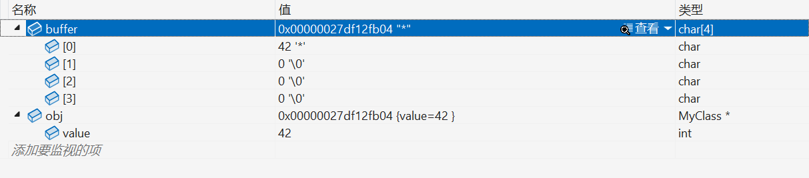
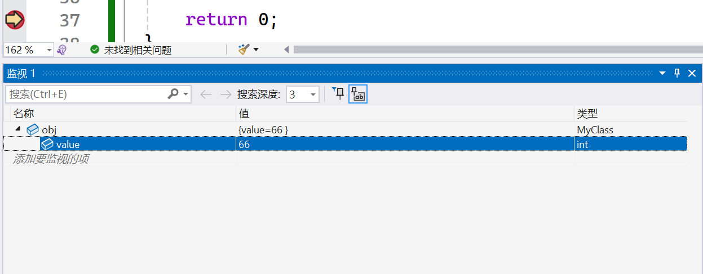

# placement new

placement new允许自己开辟一块空白的内存，然后再这个空白内存上调用构造函数，构造实例。

这就意味着，即使使用了 `new`关键字，**内存也可以不用分配在堆区，也可以分配在栈区**。具体如下：

## main.cpp:

```cpp

#include <iostream>
#include <new>

class MyClass 
{
public:
    int value;
    MyClass(int v) : value(v) 
    {
        std::cout << "Constructor called with value: " << value << std::endl;
    }
    ~MyClass() 
    {
        std::cout << "Destructor called with value: " << value << std::endl;
    }
};

int main() 
{
    std::cout << "sizeof(MyClass): " << sizeof(MyClass) << std::endl; //4

    // 分配一块足够大的内存
    char buffer[sizeof(MyClass)];

    // 使用 placement new 在 buffer 上构造对象
    MyClass* obj = new (buffer) MyClass(42);

    // 使用对象
    std::cout << "Object value: " << obj->value << std::endl; //42

    // 手动调用析构函数
    obj->~MyClass();

    //内存可能没释放？
    std::cout << "调用析构函数后，sizeof(buffer):" << sizeof(buffer) << std::endl; //4
    std::cout << "调用析构函数后，obj指向的值:"     << obj->value     << std::endl; //42
    std::cout << "调用析构函数后，sizeof(obj):"    << sizeof(obj)    << std::endl; //8
    std::cout << "调用析构函数后，sizeof(*obj):"   << sizeof(*obj);                //4

    return 0;
}

```

运行结果是：

```bash
sizeof(MyClass): 4
Constructor called with value: 42
Object value: 42
Destructor called with value: 42
调用析构函数后，sizeof(buffer):4
调用析构函数后，obj指向的值:42
调用析构函数后，sizeof(obj):8
调用析构函数后，sizeof(*obj):4
D:\github_proj\advanceC++\Debug\AdvanceCpp\bin\Debug\placementNew.exe (进程 106252)已退出，代码为 0 (0x0)。
要在调试停止时自动关闭控制台，请启用“工具”->“选项”->“调试”->“调试停止时自动关闭控制台”。
按任意键关闭此窗口. . .
```

在 `return 0`的时候断点调试，发现`buffer`和`obj`所指向的**内存并没有在析构的时候被释放**。



> 为什么会出现这种情况？一般情况下，调用析构函数不是会自动**结束对象的生命周期**吗？

因为，**结束生命周期 不等于 释放内存**。在析构函数调用的时候，只是打印操作，没有释放内存。并且这块内存本质上属于buffer数组，大小4byte。属于局部变量，**在栈区**，只有出作用域的时候销毁。

> 还有一个值得注意的一个点，就是：是根据调试信息来判断这块内存有没有被释放，而不是 `sizeof`。

因为 `sizeof` 从来**不看对象，也不看内存**，它只看**静态类型**。

```cpp
int* p = new int(42);
std::cout << sizeof(*p);  // 4 或 8，由 *p 的类型 int 决定
delete p;                 // 内存已还回堆管理器
std::cout << sizeof(*p);  // 仍然是 4 或 8
```

步骤拆解：

1. `*p` 的类型永远是 `int`，与运行期是否 `delete` 无关。
2. `sizeof` 在编译期就换成常量，**不会生成访问内存的代码**。
3. `delete` 释放的是**那块 int 大小的内存**，并没有改变“`int` 这个类型占多少字节”这一事实。

所以不管内存还在不在、值是不是垃圾，`sizeof(*p)` 始终等于 `sizeof(int)`。	

## test01.cpp:

实验普通new创建的对象，它的生命周期和内存管理：

```cpp
/*
* 普通new 的内存管理是怎样的呢
*/
#include <iostream>
#include <new>

class MyClass
{
public:
    int value;
    MyClass(int v) : value(v)
    {
        std::cout << "Constructor called with value: " << value << std::endl; //55
    }
    ~MyClass()
    {
        std::cout << "Destructor called with value: " << value << std::endl; //55
    }
};

int main()
{
    MyClass* pobj = new MyClass(55);
    std::cout << "sizeof(MyClass): " << sizeof(MyClass) << std::endl; //4
    std::cout << "sizeof(pobj): " << sizeof(pobj) << std::endl; //8
    std::cout << "sizeof(*pobj): " << sizeof(*pobj) << std::endl; //4
    std::cout << "pobj指向的地址: " << pobj << std::endl; // 00000254E0C48BA0
    std::cout << "pobj->value: " << pobj->value << std::endl << std::endl; //55

    delete(pobj);

    std::cout << "delete后：" << std::endl;
    std::cout << "sizeof(pobj): " << sizeof(pobj) << std::endl; //8 sizeof只看静态类型 MyClass* ，所以不变
    std::cout << "sizeof(*pobj): " << sizeof(*pobj) << std::endl; //4 sizeof只看静态类型 MyClass，所以不变
    std::cout << "pobj指向的地址: " << pobj << std::endl; // 00000254E0C48BA0 pobj如果不置空，就依然指向原来的地址
    //std::cout << "pobj->value: " << pobj->value << std::endl; //输出无法预知，pobj已经变为野指针

    pobj = nullptr;
    std::cout << "pobj = nullptr 后：" << std::endl;
    std::cout << "pobj指向的地址: " << pobj << std::endl; // 0000000000000000

    //delete实际上做了两件事，
    //1. 调用析构函数
    //2. 归还堆区内存

    return 0;
}

/*
Constructor called with value: 55
sizeof(MyClass): 4
sizeof(pobj): 8
sizeof(*pobj): 4
pobj指向的地址: 00000271751F8820
pobj->value: 55

Destructor called with value: 55
delete后：
sizeof(pobj): 8
sizeof(*pobj): 4
pobj指向的地址: 00000271751F8820
pobj = nullptr 后：
pobj指向的地址: 0000000000000000
*/
```

对象生命周期从new到delete之间，堆内存管理同理。

## test02.cpp:

普通局部定义的对象：

```cpp
/*
* 普通局部定义的对象 的内存管理是怎样的呢
*/
#include <iostream>
#include <new>

class MyClass
{
public:
    int value;
    MyClass(int v) : value(v)
    {
        std::cout << "Constructor called with value: " << value << std::endl; //66
    }
    ~MyClass()
    {
        std::cout << "Destructor called with value: " << value << std::endl; //66
    }
};

int main()
{
    MyClass obj(66);
    std::cout << "sizeof(MyClass): " << sizeof(MyClass) << std::endl; //4
    std::cout << "sizeof(obj): " << sizeof(obj) << std::endl; //4
    std::cout << "obj地址: " << &obj << std::endl; // 000000EDCF3DFAB4
    std::cout << "obj.value: " << obj.value << std::endl << std::endl; //66

    obj.~MyClass(); //手动调用析构函数，观察生命周期和内存管理

    std::cout << "析构后：" << std::endl;
    std::cout << "sizeof(obj): " << sizeof(obj) << std::endl; //4
    std::cout << "obj地址: " << &obj << std::endl; // 000000EDCF3DFAB4
    std::cout << "obj.value: " << obj.value << std::endl << std::endl; //66


    return 0;
}
/*
Constructor called with value: 66
sizeof(MyClass): 4
sizeof(obj): 4
obj地址: 000000EDCF3DFAB4
obj.value: 66

Destructor called with value: 66
析构后：
sizeof(obj): 4
obj地址: 000000EDCF3DFAB4
obj.value: 66
*/
```

这说明了临时的局部对象创建在栈区。即使是调用析构函数，如果析构函数没有资源管理的模块的话，内存在出作用域之前是不会被释放掉的。

仅仅结束了对象的生命周期。虽然能够读出值，但是这种做法仍旧是不建议的。



> AI回答：
>
> 你真正想问的是：
>
>> 我都手动调了 `obj.~MyClass()`，为什么地址没变、`sizeof` 没变、`obj.value` 还能读出来 66？
>> 难道“生命周期结束”是假的？
>>
>
> ——**不是假的，是你“把仪式当成拆迁”了**。
> 下面按 C++ 规则一层层拆给你看。
>
> ---
>
> 1. 析构函数到底干了啥
>
>
> - 用户代码：`~MyClass() { std::cout << ...; }`只做了“打印”这一件肉眼可见的事。
> - 编译器视角：
>   1. 执行用户代码；
>   2. 如果类里有非静态成员对象，再依次调它们的析构；
>   3. 把对象标记为“生命周期结束”。
>      **没有哪一条说要清空内存，也没有哪一条说要把字节归还给系统。**
>
> 因此**内存里的 4 字节纹丝不动**，值 66 仍躺在那里，只是**语言层面已经宣布这块字节“不再是对象”**。
>
> ---
>
> 2. 生命周期结束 ≠ 内存被回收
>
> `obj` 是**自动（栈）对象**，它的存储期由**作用域**决定：
> `main()` 的整个函数体就是它的存储期。
> 只要**右大括号 `}` 没执行**，那块栈帧就**永远属于 `obj`**，编译器**不会**提前把 `rsp` 拨回去。
> 手动析构只是**提前举行“葬礼”**，**尸体**（4 字节内存）仍停在太平间（栈帧）里，等函数返回时才一起火化。
>
> ---
>
> 3. 为什么还能读出来 66
>
> 这是**未定义行为（UB）**里最温和的一种形式：
>
> - 语言规则：生命周期结束后，任何访问 `obj` 或 `obj.value` 都 UB；
> - 物理现实：内存还没被复用，所以旧比特还在，于是“看起来正常”。
>   **换种编译选项、换个平台、或者在 `obj.~MyClass()` 之后再加一个函数调用，就可能看到值被覆盖或程序崩溃。**
>
> 现场验证 UB：
>
> ```cpp
> obj.~MyClass();          // 结束生命
> std::cout << obj.value;  // UB，但此刻大概率仍打印 66
> // 再做一次函数调用
> std::string s = "hello"; // 复用同一块栈
> std::cout << obj.value;  // 值大概率已乱甚至 SEGV
> ```
>
> ---
>
> 4. 标准条文
>    [basic.life]/8 明确规定：
>
>> After the lifetime of an object has ended and before the storage which the object occupied is reused or released, **any glvalue that refers to the original object may be used but only in limited ways** … **using the glvalue to access the stored value results in undefined behavior**.
>>
>
> ---
>
> 5. 一句话总结
>
> - 你调析构 = **提前结束对象生命**；
> - 栈内存 **要等所在作用域真正退出** 才随栈帧一起回收；
> - 生命周期结束后继续读对象 = ** UB**，只是此刻“尸体”还没被踩烂，看起来仍完好。


end
