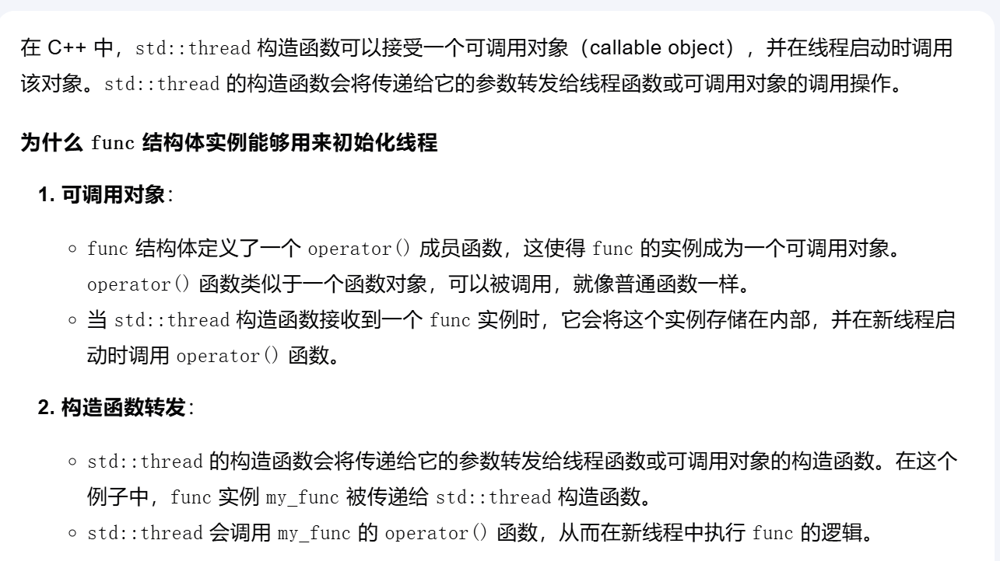
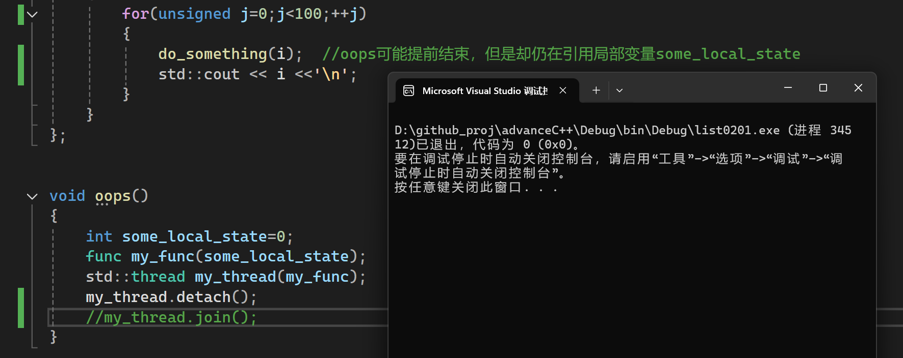
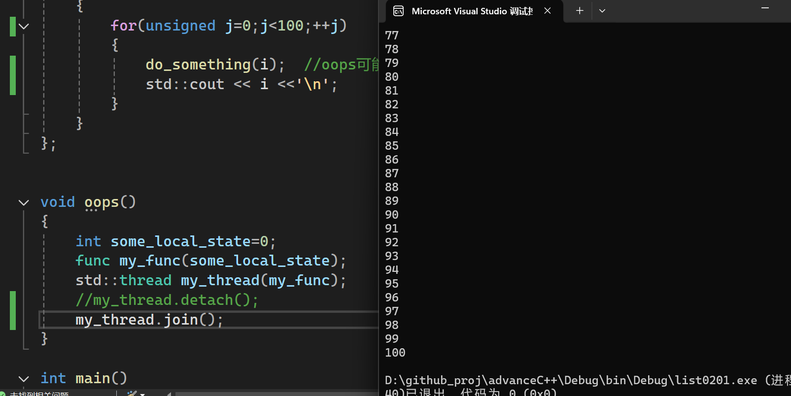

## 临时变量与命名变量

假设有如下类定义：
```cpp
class background_task
{
    //重载
    void operator ()  (  )
    {
        //...
    }
}
```
如下语句：
```cpp
std::thread my_thread(background_task());
```
实际上不是在定义线程，是在声明一个形参为`background_task()`,返回值为`std::thread`的函数。

原因在于，如果对形参传递了一个临时变量，编译器会解析为函数声明；若传递一个命名变量，便是类型对象的定义。

一下方法都能很好地避免歧义。
```cpp
std::thread my_thread((background_task()));//1
std::thread my_thread{background_task()};//2
```

## join\detach

join 方法用于等待一个线程结束，从而保证主线程能够在所有线程都执行完成后再继续执行。join 会阻塞调用它的线程，直到被 join 的线程完成执行。

detach 方法用于将线程分离，使其在后台运行。分离后的线程不再与 std::thread 对象关联，主线程不会等待分离后的线程结束。分离后的线程会在后台独立运行，直到完成其任务。

在`list0201.cpp`中，为什么`my_func`这个结构体实例能够用来初始化线程?


0201代码中有潜在的问题，这个问题并不会导致编译错，但是会导致未定义行为。
线程创建完成之后就`detach`，但是
```cpp
int& i;

func(int& i_):i(i_){} //i 与 i_ 都是some_local_state 的引用
```
会出现
```cpp
do_something(i);  //oops可能提前结束，但是却仍在引用局部变量some_local_state
```

所以0201代码并不严谨，存在错误。

处理这种错误的常规方法就是将数据复制到线程中，而非直接引用。

当然，如果使用的是`join`阻塞主线程，可以使用引用的方式创建线程。


还需要注意的是，使用`detach`没有任何输出。
而使用`join`会有输出。

`detach`:


`join`:
