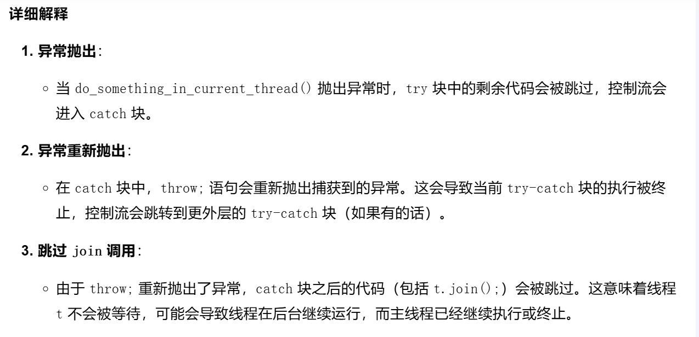

## 如果catch语句中没有join()

如果 catch 块中重新抛出异常（throw;），并且没有其他地方捕获这个异常，程序将提前退出。此时，线程 t 可能还在运行，但主线程已经结束。这会导致线程被强制终止，可能会导致以下问题：
- 资源泄漏：线程占用的资源可能不会被正确释放。
- 数据不一致：线程可能在执行某些操作时被中断，导致数据不一致。

通常在异常处理的时候也加上`join()`，避免抛出异常之后直接跳过了`join()`

如果catch加上`join()`，就要考虑重复调用join()的问题，可以使用`joinable()`解决。
