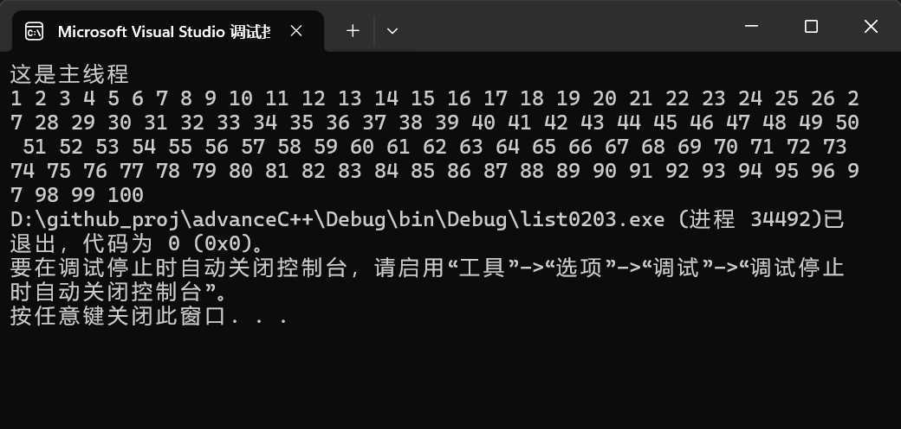
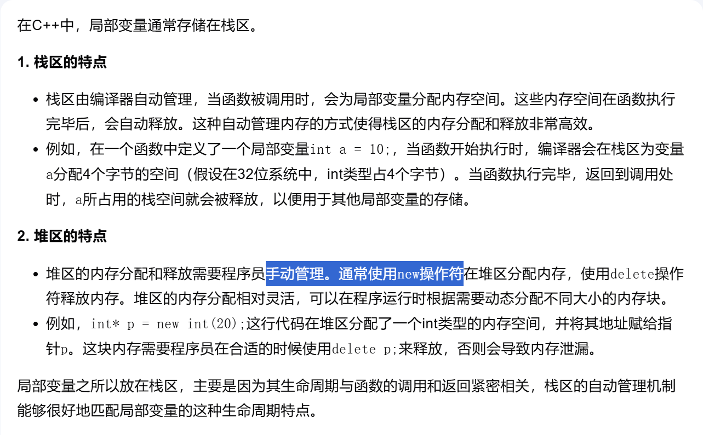

RAII(Resource Acquisition Is Initialization)
提供一个类，在析构中执行`join()`

运行结果如下:


可见执行了`do_something_in_current_thread();` 之后并没有直接退出f()的作用域。

因为在析构对象`g`的时候，需要等待线程的完成。

代码在执行到4处的时候，会逆序销毁局部对象。
```cpp
void f()
{
    int some_local_state = 0;
    func my_func(some_local_state);
    std::thread t(my_func);

    //把线程放到类里面，当出作用域时调用析构函数
    //析构函数里面又等待线程的完成，很好地解决了代码0202中线程周期的问题
    thread_guard g(t);
        
    do_something_in_current_thread();
}//4
```
至于为什么是逆序，因为局部变量除了手动的new是在堆区，其余基本上都在栈区。


这样不用担心局部变量引用的问题。

即使`do_something_in_current_thread()`抛出异常，对象`g`的销毁依然会执行，保证了`join`的执行。
