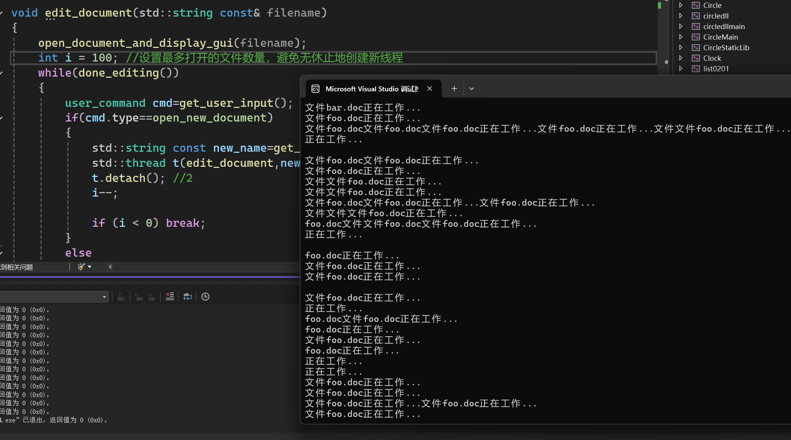
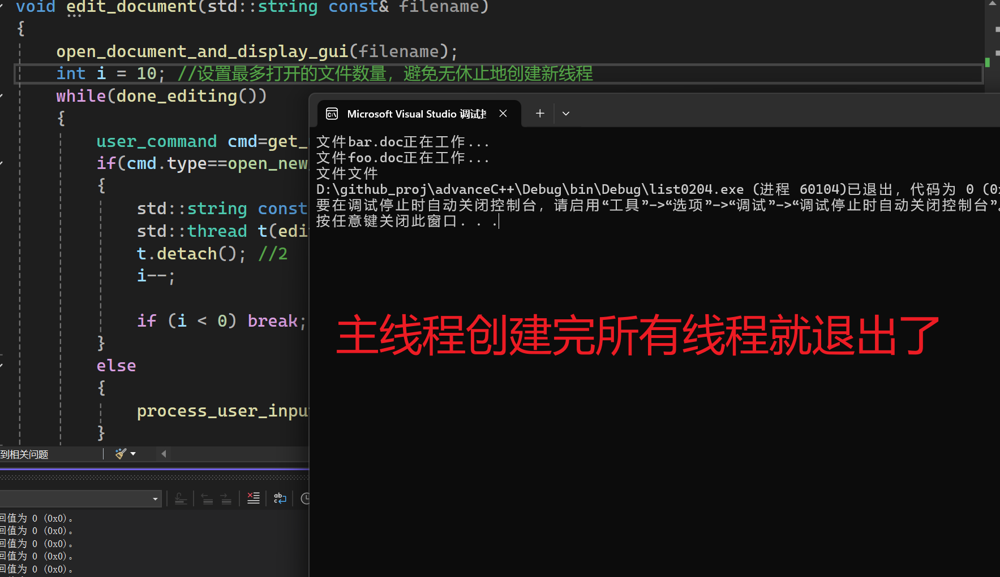
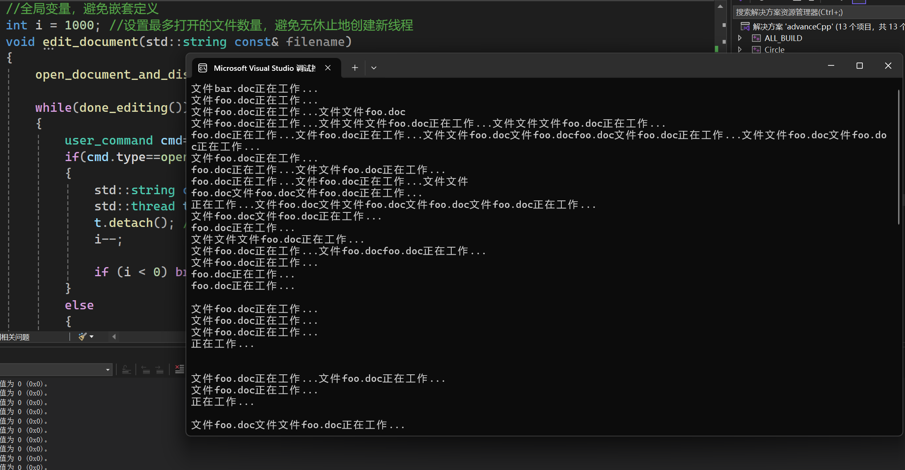

使用`detach()`之后的线程在后台运行，并且也无法汇入。

不能对没有执行线程的`std::thread`对象使用`detach()`。所以，可以使用`joinable()`检查，如果返回值为true，表示可以使用`detach()`分离线程。

代码0204是一个使用分离线程处理文档的示例。
原理是让每个文档处理窗口都拥有自己的线程，分离后互不干扰。

创建线程之后就分离，这样就与创建它的线程无关了。这里使用了传参创建线程的方法。
```cpp
std::thread t(edit_document,new_name); //1
t.detach(); //2
```

我在试验的时候，发现如果代码是：
```cpp
void edit_document(std::string const& filename)
{
    open_document_and_display_gui(filename);
    
    while(done_editing())
    {
        user_command cmd=get_user_input();
        if(cmd.type==open_new_document)
        {
            std::string const new_name=get_filename_from_user();
            std::thread t(edit_document,new_name); //1
            t.detach(); //2
            i--;

            if (i < 0) break;
        }
        else
        {
            process_user_input(cmd);
        }
    }
}
```
没有任何限制，会无休止地创建线程，并且速度非常快，成指数上升。

所以我就尝试在函数`edit_document`里面添加限制，限制了int i = 100的情况，但是在主线程创建一百个线程之后，
不代表其他的后台线程就不会继续创建了，这依然很糟糕。
```cpp
```cpp
void edit_document(std::string const& filename)
{
    open_document_and_display_gui(filename);
    int i = 100;
    while(done_editing())
    {
        user_command cmd=get_user_input();
        if(cmd.type==open_new_document)
        {
            std::string const new_name=get_filename_from_user();
            std::thread t(edit_document,new_name); //1
            t.detach(); //2
            i--;

            if (i < 0) break;
        }
        else
        {
            process_user_input(cmd);
        }
    }
}
```

那既然如此，i=10 和 i=100的执行结果为什么不一样？



i的大小只是决定了主线程的生存时间，但是后台线程的数量理论依然是无限创造的。（实际上会受到操作系统的资源限制）。

所以，将i = 100变成全局变量，只允许100个线程创建。



