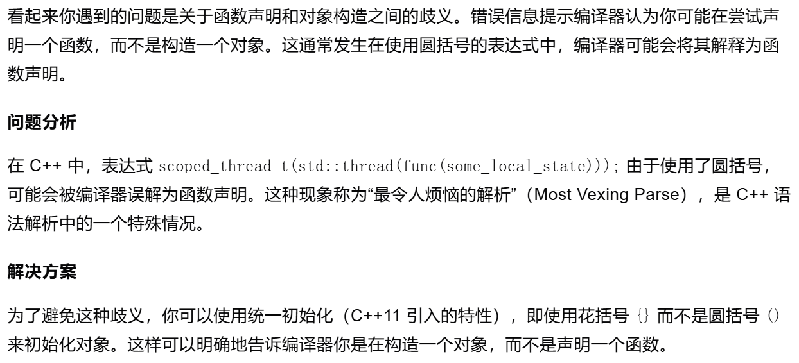

当某个对象转移了线程的所有权，就不能再对线程进行汇入和分离。
为了保证线程在程序退出前完成，定义了scoped_thread类。

scoped_thread类：
```cpp
class scoped_thread
{
    std::thread t;
public:
    explicit scoped_thread(std::thread t_):
        t(std::move(t_))
    {
        if(!t.joinable())  //检查是否可汇入
            throw std::logic_error("No thread");
    }
    ~scoped_thread()
    {
        t.join();
    }
    scoped_thread(scoped_thread const&)=delete;
    scoped_thread& operator=(scoped_thread const&)=delete;
};
```

下面的代码：
```cpp
scoped_thread t(std::thread(func(some_local_state)));
```
`func(some_local_state)`是可调用对象，构造了一个临时的`std::thread`对象。
临时的对象出了作用域就会被销毁，所以构造的时候要把资源转移过来。

实际运行的时候有一个非常有意思的问题。这个问题之前提到过，但是这里出现地更加隐蔽。

如果`f`函数是这样的：
```cpp
void f()
{
    int some_local_state = 0;
    scoped_thread t( std::thread(func(some_local_state)) );
    
    do_something_in_current_thread();
}
```
运行的时候，会出现
```cpp
void do_something(int& i)
{
    ++i;
    //std::lock_guard<std::mutex> lock(io_mutex); // 使用互斥锁保护输出
    std::cout << i << " ";
}
```
上述代码没有执行的情况。在单步调试的时候，也会发现，直接跳过了`scoped_thread t( std::thread(func(some_local_state)) );`这句。

这是为什么？
我最开始以为是线程同步互斥的问题，其实不是的。
其实是这里的构造语句错误地被编译器当成`函数声明的语句`了。

这个问题是怎么发现的呢？
我换了一种写法，将`scoped_thread t( std::thread(func(some_local_state)) );`等价换成：
```cpp
std::thread aa(func(some_local_state)); // 创建 std::thread 对象
scoped_thread t(std::move(aa)); // 使用 std::move 将 aa 移动到 scoped_thread 对象中
```

然后编译器就报错了：
```
“scoped_thread t(std::thread (__cdecl *)(func))”: 未调用原型函数(是否是有意用变量定义的?) 
```

发现这个问题其实是比较普遍的：



解决方法在Unit2的Part1就提到了。
使用C++统一的赋值规则就能避免。
```cpp
void f()
{
    int some_local_state = 0;
    scoped_thread t{ std::thread(func(some_local_state)) };
    
    do_something_in_current_thread();
}
```

运行结果如下：
