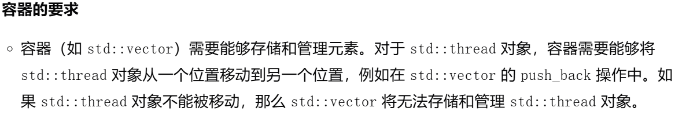
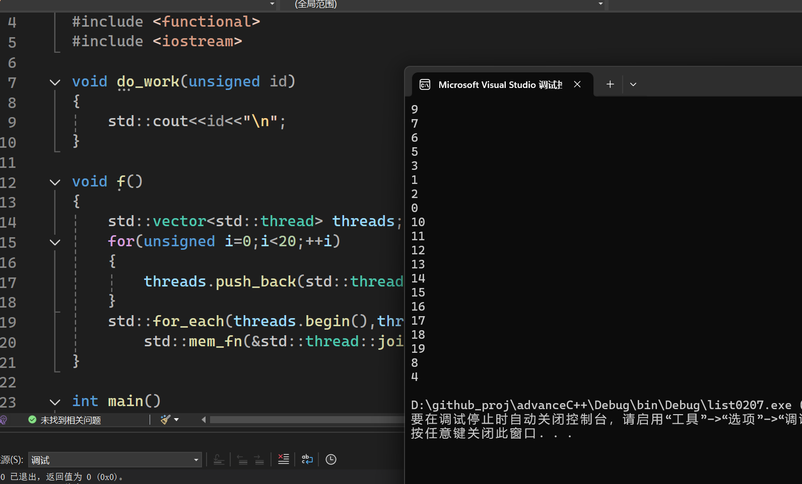

std::thread对象的容器，如果这个容器是移动敏感的。
(比如vector<>)
```
在 C++ 中，容器是移动敏感的（move-aware）意味着容器支持移动语义（move semantics），
可以高效地处理资源的转移，而不仅仅是复制。
```
那么移动操作同样适用于这些容器。


为什么需要容器支持移动语义呢？
因为在批量管理线程的时候，会出现线程资源转移的情况。


运行结果显示，线程结束的顺序与创建线程的顺序无关。
