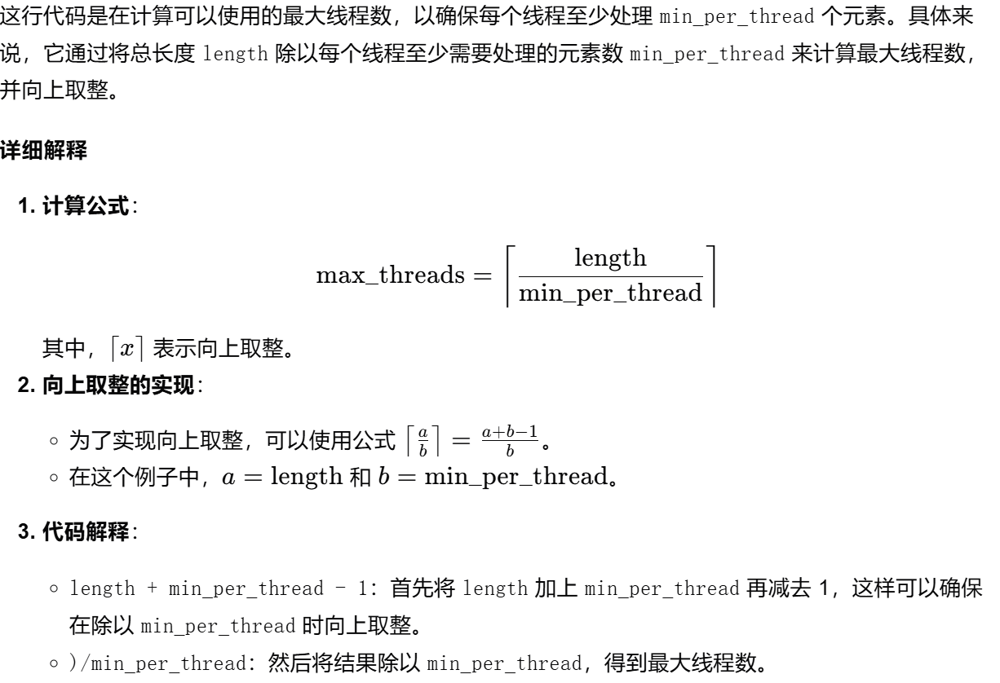
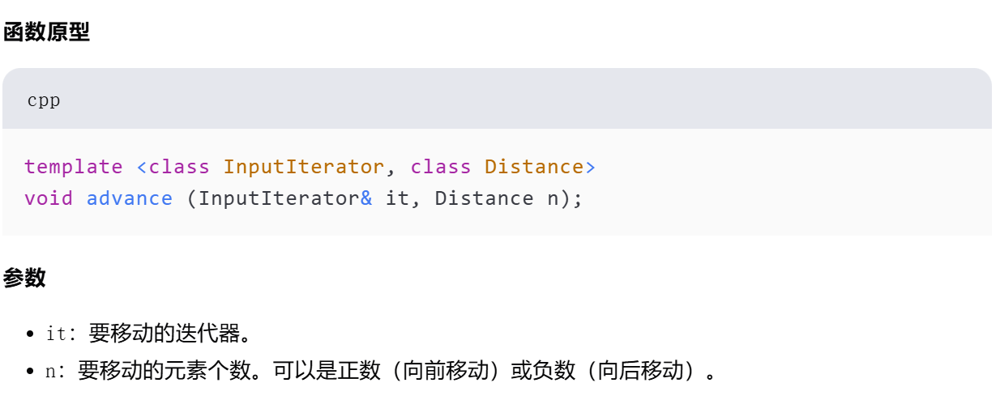
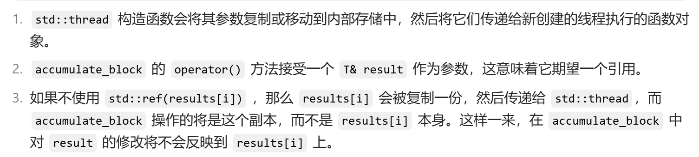
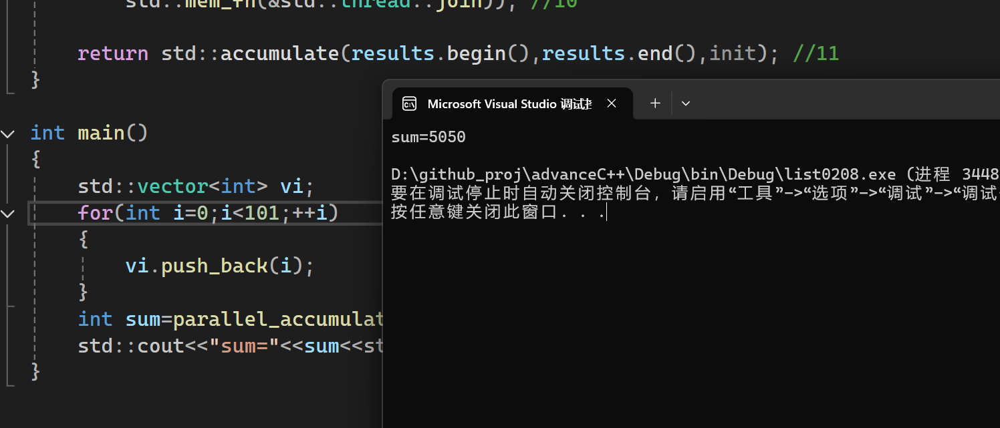

`std::distance(first, last)` 计算的是从迭代器 `first` 到迭代器 `last` 之间的元素个数，不包括 `last` 指向的元素，但包括 `first` 指向的元素。这与 C++ 中的半开区间 `[first, last)` 一致，即包括起始迭代器 `first`，但不包括结束迭代器 `last`。

如果输入范围为空，就会得到`init`值。
```cpp
if(!length) //1
    return init;
```

如果范围内的元素多余一个时，就会计算线程块中的最小任务数：
```cpp
unsigned long const min_per_thread=25;
unsigned long const max_threads=
    (length+min_per_thread-1)/min_per_thread; //2
```


求解最大线程数的时候，注意向上取整。

线程之间的切换是需要上下文开销的，计算硬件资源支持的线程数量有利于提升总体性能。
计算硬件支持线程数：
```cpp
unsigned long const hardware_threads=
    std::thread::hardware_concurrency();

unsigned long const num_threads= //3
    std::min(hardware_threads!=0?hardware_threads:2,max_threads);
```
首先`hardware_threads!=0?hardware_threads:2`,如果`hardware_concurrency()`返回0，
那么就设置一个较小的值作为启动线程的数量，这里是`2`。
然后再与`max_threads`对比，选择较小的值作为启动线程的数量。

元素总量/线程数量 = 每个线程处理元素的数量
```cpp
unsigned long const block_size=length/num_threads; //4
```

存放结果，`num_threads`只有前面`num_threads -1`个线程能保证一定可以分到完整的块。
最后一个线程是余下的可能不能组成完整块的元素。
```cpp
std::vector<T> results(num_threads);
std::vector<std::thread>  threads(num_threads-1); //5
```

移动迭代器block_end至每个线程处理块的末尾：
```cpp
Iterator block_end=block_start; //初始化迭代器
std::advance(block_end,block_size); //6
```


累计范围为 `[first, last)`
```cpp
std::accumulate(first,last,result);
```

直接传参会导致函数修改的是副本而不是`result[i]`，使用`std::ref(results[i])`可以转换变成引用。
使用 `std::ref` 用于包装变量，使得在一些默认按值传递的模板函数或算法中，可以将变量的引用传递给它们，以实现对原变量的修改。例如 `std::bind、std::async` 等函数模板，如果不使用 `std::ref`，它们会复制参数，使用 `std::ref` 则会传递引用，避免复制并允许修改原变量。

构建`std::thread`会拷贝一份参数副本，为了能够实时改变结果，使用`std::ref`转换为引用。

启动一个新的线程并授予任务：
```cpp
threads[i]=std::thread( //7
    accumulate_block<Iterator,T>(),
    block_start,block_end,std::ref(results[i]));
```

计算最后剩余的。
```cpp
accumulate_block<Iterator,T>()(block_start,last,results[num_threads-1]); //9
```

等待所有线程执行完毕:
```cpp
std::for_each(threads.begin(),threads.end(),
    std::mem_fn(&std::thread::join)); //10
```

运行结果：
