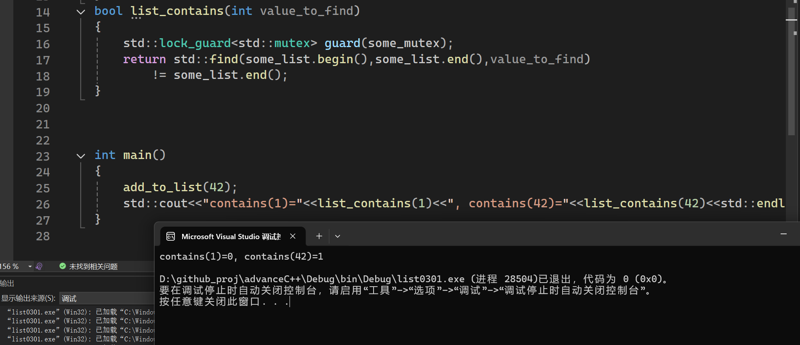

实例化`std::mutex some_mutex`创建`互斥量`实例。
其中`std::mutex`中的成员函数`lock()`可对互斥量上锁，`unlock()`可对互斥量解锁。
这样就意味着在每个函数的出口都要去`unlock()`，包括异常处理的情况。

这样的做法是不推荐的。标准库中的`RAII`模板类，在构造时就能上锁，在析构时正确解锁。


代码0301中，全局的变量`some_mutex`被全局的互斥量保护`some_list`。
```cpp
std::list<int> some_list;
std::mutex some_mutex;
```
某些时候使用全局互斥量没有问题，大多数时候，互斥量会与需要保护的数据放在同一类中，不推荐直接定义成全局变量。

0301中的两个函数，对`list`对象的访问是互斥的，因为都使用了`std::lock_guard<std::mutex> guard(some_mutex)`上锁。

下面这句代码执行之后
```cpp
add_to_list(42);
```
`list_contains`不可能看到正在被`add_to_list()`修改的列表。

（在C++17下，`std::lock_guard<std::mutex> guard(some_mutex)`可以简化成`std::lock_guard guard(some_mutex)`）应为添加了模板类参数推导的新特性。

返回的是bool值：
- 返回`0`,没有找到`value_to_find`。
- 返回`1`,找到`value_to_find`。
`return std::find(some_list.begin(), some_list.end(), value_to_find) != some_list.end();`

运行结果：
