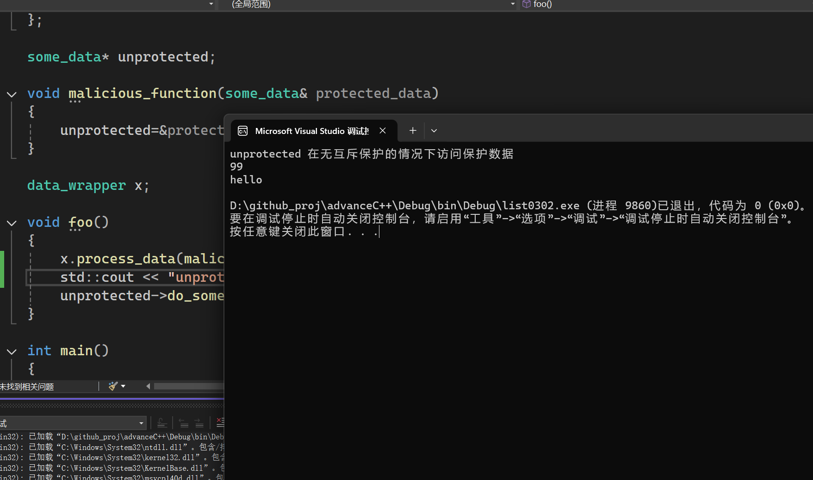

使用`指针`或者`引用`的共享数据，仅仅使用`互斥量`还不能够完全保护。

代码0302中无意中传递了保护数据的引用。

`some_data`封装了数据类。
`data_wrapper`则是一个使用线程保护机制保护`data_wrapper`的类。

`malicious_function`是一个恶意函数，接受一个`some_data`对象的引用`protected_data`作为参数。函数体内，将`protected_data`的地址赋值给全局指针`unprotected`。
这样，`unprotected`就指向了被`data_wrapper`类保护的`data`对象。


```cpp
some_data* unprotected;

void malicious_function(some_data& protected_data)
{
    unprotected=&protected_data;
}

data_wrapper x;

void foo()
{
    x.process_data(malicious_function); //2 传递一个恶意函数
    unprotected->do_something(); //在无权保护的情况下访问保护数据
}
```
首先调用`x.process_data(malicious_function)`，将`malicious_function`作为参数传递给`data_wrapper`对象`x`的`process_data`函数。
在`process_data`函数中，`获取互斥锁`后，调用`malicious_function`并将`data`对象传递给它。
```cpp
    void process_data(Function func)
    {
        std::lock_guard<std::mutex> l(m);
        func(data);  //1 传递保护数据给用户函数
    }
```
此时，`malicious_function`将`data`对象的地址赋值给全局指针`unprotected`。
```cpp
unprotected = &protected_data;
```

这就导致本来被线程安全类`data_wrapper`保护的私有的`some_data`类对象突然被一个全局指针引用了。

然后通过`unprotected->do_something()`调用`some_data`对象的`do_something`函数。由于`unprotected`指向的是`data_wrapper`类中被保护的`data`对象，此时相当于绕过了`data_wrapper`类的保护机制，在没有互斥锁保护的情况下访问和操作`data`对象，会导致线程安全问题。

这段代码其实根本没有保护，只是将可访问的数据结构的代码标记为互斥。函数`foo()`中调用`unprotected->do_something（）`的代码没有标记为互斥。这种情况下，只能注意`切勿将受保护的数据的指针或者引用传递到互斥锁作用域之外`。

运行结果：


