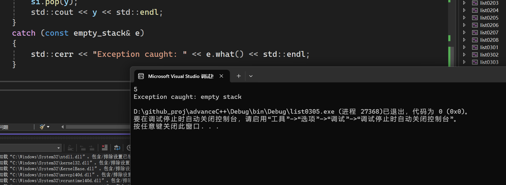

拷贝构造函数对互斥量上锁。这样保证拷贝结果的正确性，这种方式比成员初始化列表要好。
```cpp
threadsafe_stack(const threadsafe_stack& other) //拷贝构造
{
    std::lock_guard<std::mutex> lock(other.m);
    data=other.data;
}
```

两个 pop 函数分别用于不同的使用场景，主要区别在于它们如何返回栈顶元素。
1. `std::shared_ptr<T> pop()`
```cpp
std::shared_ptr<T> pop()
{
    std::lock_guard<std::mutex> lock(m);
    if (data.empty()) throw empty_stack();
    std::shared_ptr<T> const res(std::make_shared<T>(data.top()));
    data.pop();
    return res;
}
```
返回栈顶元素的智能指针：这个函数返回一个 `std::shared_ptr<T>`，即栈顶元素的智能指针。这使得调用者可以方便地管理栈顶元素的生命周期，而不需要担心内存泄漏。
使用场景:
需要动态管理栈顶元素：当调用者需要在栈外继续使用栈顶元素，并且希望自动管理该元素的生命周期时，这个函数非常有用。例如，栈顶元素可能是一个复杂对象，调用者需要在多个地方使用这个对象，而不需要手动管理内存。
多线程环境：由于使用了 `std::lock_guard<std::mutex>`，这个函数是线程安全的。在多线程环境中，多个线程可以安全地调用这个函数，而不会导致数据竞争或竞态条件。
示例:
```cpp
try
{
    std::shared_ptr<T> topElement = stack.pop();
    // 使用 topElement，它是一个智能指针，自动管理内存
}
catch (const empty_stack& e)
{
    std::cerr << "Exception caught: " << e.what() << std::endl;
}
```


2. `void pop(T& value)`
```cpp
void pop(T& value)
{
    std::lock_guard<std::mutex> lock(m);
    if (data.empty()) throw empty_stack();
    value = data.top();
    data.pop();
}
```
直接修改传入的引用：这个函数接受一个引用参数 `T& value`，并将栈顶元素的值赋给这个引用。调用者需要提供一个已经声明的变量来接收栈顶元素的值。
使用场景:
直接使用栈顶元素：当调用者只需要使用栈顶元素的值，而不需要动态管理其生命周期时，这个函数非常方便。例如，栈顶元素是一个简单的值类型（如 `int`、`double` 等），调用者只需要这个值进行一些计算或操作。
多线程环境：同样，由于使用了 `std::lock_guard<std::mutex>`，这个函数也是线程安全的。在多线程环境中，多个线程可以安全地调用这个函数，而不会导致数据竞争或竞态条件。
示例:
```cpp
T value;
try
{
    stack.pop(value);
    // 使用 value，它是一个普通变量
}
catch (const empty_stack& e)
{
    std::cerr << "Exception caught: " << e.what() << std::endl;
}
```

运行结果：


第三次执行`pop`的时候，由于栈空，会抛出到异常`if (data.empty()) throw empty_stack();`
在异常传播的过程中，`throw()`语句后面的代码均不会执行，而是向上查找`catch`块并捕获异常。如果向上查找的过程中，异常始终没有捕获，就会中断程序。
